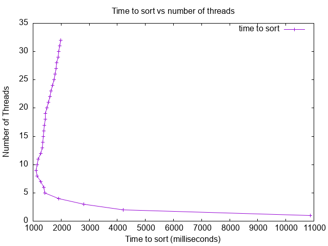

## Analysis
* Were you able to generate something close to what the example showed? Why or why not.
Yes, I was able to generate something close to what the example showed. I ended
up generating two graphs, one in low power mode and the other without this 
feature enabled. I did this because I keep my Mac in low power mode to conserve
energy and preserve my battery. I did not realize there was a difference in
performance speed using this two modes because I usually don't notice any 
performance issues. The performance issue I realized wasn't from my Mac
slowing down but rather seeing that the graph my M2 Mac generated was slower
for every thread compared to the example graph generated from a M1 Mac. I
eventually came up with the idea to turn off low power mode to see if it made
a difference in performance and it did!

The first graph below shows the graph `createplot.sh` generated when my Mac 
was running in low power mode. The second graph below was generated when my
Mac was not running in low power mode. This second graph outperforms the first
graph for every thread and almost doubles the speed of sorting at the optimal
thread amount by a factor of two. The second graph also outperforms the example
at least marginally for every thread number. Outperforming the example graph
was not suprising because the M2 ARM processor is more powerful than its M1
predecessor. It was interesting to see that there is a tradeoff my computer
has when running in low power mode even though I tend to not notice it in my
day to day computing.

* Did you see a slow down at some point why or why not?
Both modes had a similar trend of slowing down time to sort after increasing
thread number past 9 threads. This appears to be the threshold for 
my computer before overhead costs for context switching outweighs benefits
for using threads to sort separate chunks of the array. Not only could the
context switching lead to more costs but the benefits of having more threads
may not be very useful when the chunks each thread sorts becomes smaller and
smaller.

Although both graphs had a similar slow down trend, the normal power mode
graph (second) had a smoother linear trend when compared to the low power mode.
Interestingly, the other parts of both graphs are very similar and do not show
any changes other than this slow down section.
 
* Did your program run faster and faster when you added more threads? Why or why not?
My program did run faster and faster up to reaching 9 threads in both modes. 
This is because adding more threads allowed for more chunks of the array to
be sorted in parallel even with the additional overhead costs of context 
switching between threads.
 
* What was the optimum number of threads for your machine?
The optimum number of threads for my machine in both low power and normal mode
is 9 threads.
 
* What was the slowest number of threads for your machine?
The slowest number of threads for my machine in both low power and normal mode
is 1 thread. 
